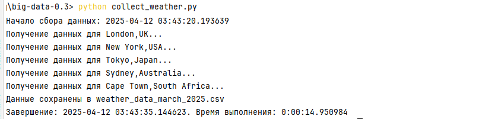

## Вводный курс по Big Data (семинары)
## Урок 3. Инструменты работы и визуализации

### Описание

1. Работа с Docker - поднятие zeppelin, jupyter и superset
2. Разбор примера настройки, изучения и визуализации данных (SQL)


### Домашнее задание

1. Соберите данные о погоде в разных городах мира за последний месяц. <br>
   Используйте открытые источники данных, такие как API погодных сервисов или веб-скрейпинг.
2. Выведете график изменения температуры в разных городах, график распределения температуры.
3. Сохранить результаты в HDFS
4. Выгрузить результаты из HDFS на локальный компьютер

<br><hr><hr>

### Общая информация

Docker - это платформа для контейнеризации приложений, позволяющая запускать приложения <br>
в изолированных контейнерах, что упрощает развертывание и управление приложениями. <br>
В контексте работы с большими данными (Big Data), Docker часто используется для запуска <br>
различных инструментов анализа и визуализации данных. <br>

Есть три популярных и часто используемых инструмента: Zeppelin, Jupyter и Superset.<br>
Zeppelin, Jupyter и Superset - это мощные инструменты для работы с большими данными, <br>
каждый из которых имеет свою специфику и область применения.<br> 
Zeppelin и Jupyter отлично подходят для исследовательской работы и анализа данных, <br>
тогда как Superset больше ориентирован на создание бизнес-отчетов и визуализаций. <br>
Использование Docker значительно упрощает развертывание и управление этими инструментами, <br>
делая их доступными для широкого круга пользователей.

#### 1. Apache Zeppelin

**Apache Zeppelin** - это веб-приложение для интерактивной обработки данных и создания отчетов. <br>
Оно поддерживает различные языки программирования и аналитические движки, <br>
такие как Spark, Hive, Flink и другие. Zeppelin позволяет создавать ноты (notebooks), <br>
которые содержат код, визуализацию данных и текстовые пояснения.<br>

Zeppelin широко используется для анализа данных, машинного обучения и построения отчетов. <br>
Благодаря поддержке множества языков и интерпретаторов, он подходит для работы <br>
с различными источниками данных и выполнения сложных вычислений.<br>

##### Применение в практике

1. **Запуск Docker-контейнера**: Применить официальный образ Apache Zeppelin из Docker Hub. 
   Например, выполнить команду, которая запустит Zeppelin на порту 8080 
   и смонтирует директорию `notebook` для сохранения нот.:
   ```bash
   docker run -p 8080:8080 --rm -v $PWD/notebook:/zeppelin/notebook apache/zeppelin:latest
   ```
2. **Создание ноты**: После запуска перейти в браузер по адресу `http://localhost:8080`. <br> 
   Создать новую ноту и выбрать интерпретатор, например, Spark или Python.

3. **Анализ данных**: Выполнить запросы к данным, используя встроенный SQL-интерпретатор или Python-код.  <br>
   Результаты будут отображаться прямо в ноте вместе с графиками и диаграммами.

4. **Совместная работа**: Ноты можно экспортировать и делиться ими с другими участниками разработки,  <br>
   что делает Zeppelin удобным инструментом для командной работы над проектами.

##### Документация

- [Документация Apache Zeppelin](https://zeppelin.apache.org/docs/latest/)
- [Docker-образ Apache Zeppelin](https://hub.docker.com/r/apache/zeppelin)

<hr>

#### 2. Jupyter Notebook

**Jupyter Notebook** - это интерактивная среда разработки, предназначенная для написания и выполнения кода, <br> 
а также документирования результатов. Она поддерживает множество языков программирования, <br> 
включая Python, R, Julia и многие другие. Jupyter Notebook позволяет создавать ноты,  <br>
содержащие код, текстовые комментарии и результаты выполнения кода. <br>

Jupyter Notebook используется для исследовательского анализа данных, прототипирования моделей <br> 
машинного обучения и создания интерактивных документов. <br> 
Его популярность обусловлена простотой использования и возможностью интеграции с библиотеками <br> 
для работы с данными, такими как Pandas, NumPy и Scikit-learn. <br>

##### Применение в практике

1. **Запуск Docker-контейнера**: Используйте официальный образ Jupyter из Docker Hub. <br>
   Например, выполнить команду, которая запустит Jupyter Notebook на порту 8888 
   и смонтирует директорию `work` для хранения нот:
   ```bash
   docker run -p 8888:8888 --rm -v $PWD/work:/home/jovyan/work jupyter/scipy-notebook
   ```
2. **Создание ноты**: Перейти в браузер по адресу `http://localhost:8888` и создать новую ноту. <br> 
   Выбрать язык программирования, например, Python.

3. **Анализ данных**: Импортировать данные, выполнить операции с ними и визуализировать результаты <br>
   с помощью графиков и таблиц. Все это будет сохранено в одной ноте.

4. **Интеграция с Big Data**: Jupyter Notebook хорошо интегрируется с платформами для работы <br> 
   с большими данными, такими как Apache Spark. Можно подключаться к кластерам Spark и <br>
   выполнять распределенные вычисления прямо из ноты.

##### Документация

- [Документация Jupyter](https://jupyter.org/documentation)
- [Docker-образ Jupyter](https://hub.docker.com/u/jupyter)

<hr>

#### 3. Superset

**Superset** - это инструмент для визуализации данных и построения дашбордов. <br> 
Он позволяет создавать интерактивные графики и отчеты на основе данных из различных источников, <br> 
таких как PostgreSQL, MySQL, MongoDB и др. Superset предоставляет удобный интерфейс для работы <br> 
с метаданными и создания дашбордов без необходимости писать код. <br>

Superset используется для создания бизнес-отчетов, мониторинга ключевых показателей эффективности (KPI) <br> 
и визуального анализа данных. Он особенно полезен для пользователей, которые <br> 
хотят быстро получить доступ к данным и создать красивые визуализации <br> 
без глубокого знания программирования.

Установка Superset из репозитория на GitHub: https://github.com/apache/superset командой:
```bash
git clone https://github.com/apache/superset
```

##### Документация
- Docker: https://docs.docker.com/
- Superset: https://superset.apache.org/docs/

<hr>

##### Применение в практике

1. **Запуск Docker-контейнера**: Использовать официальный образ Superset из Docker Hub. <br> 
   Например, выполнить команду, которая запустит Superset на порту 8088:
   ```bash
   docker run -d -p 8088:8088 --name superset apache/superset
   ```
2. **Настройка подключения к данным**: После запуска перейти в браузер по адресу <br>
   `http://localhost:8088` и войти в систему с учетными данными по умолчанию (`admin/admin`). <br>
   Добавить подключение к имеющемуся источнику данных через меню "Sources" > "Databases".

3. **Создание дашборда**: Используя интерфейс Superset, создать новые визуализации и объединяя их <br> 
   в дашборды. Поддерживаются различные типы графиков, такие как линейные, столбчатые, <br> 
   круговые диаграммы и карты.

4. **Интерактивность**: Дашборды в Superset могут быть интерактивными, позволяя пользователям <br> 
   фильтровать данные и исследовать их глубже.

##### Документация

- [Документация Superset](https://superset.apache.org/docs/introduction)
- [Docker-образ Superset](https://hub.docker.com/r/apache/superset)

<hr>

#### 4. Библиотека Python: requests

**Библиотека requests** - это простая, элегантная HTTP-библиотека для Python, широко используемая <br>
для создания веб-запросов, как GET и POST, и для веб-взаимодействия. <br>
Позволяет облегчать работу в версии HTTP, позволяя легко извлекать данные из API-интерфейсов или веб-сайтов. <br> 
Официальная документация: [документация по requests](https://requests.readthedocs.io/en/latest/). Пример:
```
import requests

# Fetch data from a sample API
response = requests.get('https://api.github.com')
if response.status_code == 200:
    print(response.json())  # Print JSON response
else:
    print(f"Failed with status code: {response.status_code}")
```
В представленном примере GET-запрос отправляется в API GitHub и выводится ответ. 

Установка: `pip install requests`
(см. [официальные инструкции](https://requests.readthedocs.io/en/latest/user/install/#install))

<hr>

#### 5. Библиотека Python: pandas

**Библиотека pandas** - это мощный инструмент для манипулирования данными и для анализа данных в Python. <br>
Предоставляет структуры данных, такие как фреймы данных и ряды, что упрощает работу со структурированными данными,
такими как CSV-файлы или базы данных. <br> 
Официальная документация: [документация по pandas](http://pandas.pydata.org/docs/). Пример:

```
import pandas as pd

# Create a simple DataFrame
data = {'Name': ['Alice', 'Bob'], 'Age': [25, 30]}
df = pd.DataFrame(data)

# Display the DataFrame
print(df)

# Basic operation: filter rows
print(df[df['Age'] > 25])
```
В данном примере создается фрейм данных и выполняется его фильтрация, <br>
чтобы отображались строки, возраст которых превышает 25 лет.

Установка: `pip install pandas`
(см. [официальные инструкции](https://pandas.pydata.org/docs/getting_started/install.html))

<hr>

#### 6. Основные команды HDFS (Hadoop Distributed File System) 

Это основные команды для работы с HDFS, список наиболее часто используемых команд, которые позволяют <br>
эффективно управлять данными в кластере Hadoop. Они используются для управления файлами и каталогами <br>
в распределенной файловой системе Hadoop.

##### 1. Создание каталога
```bash
hdfs dfs -mkdir /path/to/directory
```
Пример:
```bash
hdfs dfs -mkdir /user/hadoop/data
```

##### 2. Копирование файлов в HDFS
```bash
hdfs dfs -put local_file_path hdfs_file_path
```
Пример:
```bash
hdfs dfs -put /home/hadoop/file.txt /user/hadoop/data/
```

##### 3. Просмотр содержимого каталога
```bash
hdfs dfs -ls /path/to/directory
```
Пример:
```bash
hdfs dfs -ls /user/hadoop/data
```

##### 4. Удаление файла или каталога
```bash
hdfs dfs -rm /path/to/file_or_directory
# или
hdfs dfs -rm <file>
```
Пример:
```bash
hdfs dfs -rm /user/hadoop/data/file.txt
```
Для удаления в обход корзины можно использовать флаг --skipTrash
```bash
hdfs dfs -rm  --skipTrash <file>
```

##### 5. Переименование файла или каталога
```bash
hdfs dfs -mv source destination
```
Пример:
```bash
hdfs dfs -mv /user/hadoop/oldfile.txt /user/hadoop/newfile.txt
```

##### 6. Получение информации о файле или каталоге
```bash
hdfs dfs -stat /path/to/file_or_directory
```
Пример:
```bash
hdfs dfs -stat /user/hadoop/data/file.txt
```

##### 7. Проверка наличия файла или каталога
```bash
hdfs dfs -test -e /path/to/file_or_directory
```
Пример:
```bash
hdfs dfs -test -e /user/hadoop/data
```

##### 8. Чтение файла
```bash
hdfs dfs -cat /path/to/file
```
Пример:
```bash
hdfs dfs -cat /user/hadoop/data/file.txt
```

##### 9. Скачивание файла из HDFS
```bash
hdfs dfs -get hdfs_file_path local_file_path
```
Пример:
```bash
hdfs dfs -get /user/hadoop/data/file.txt /home/hadoop/downloads/
```

##### 10. Показ размера файла или каталога
```bash
hdfs dfs -du /path/to/file_or_directory
# или
hdfs dfs -du -h
```
Пример:
```bash
hdfs dfs -du /user/hadoop/data
```

##### Документация
- Hadoop HDFS: https://hadoop.apache.org/docs/stable/hadoop-project-dist/hadoop-hdfs/HDFS_Commands.html
- Hadoop Docker Image: https://github.com/sequenceiq/hadoop-docker

<br><br><hr>

## Решение задания

<br><br><hr>

### Задание 1: Сбор данных о погоде в разных городах мира за март 2025 года

<br><br>

Для сбора данных о погоде можно использовать Visual Crossing Weather API, который предоставляет 
прогнозные данные о погоде через RESTful API. 

Для работы необходимо:
1. Зарегистрироваться на [Visual Crossing](https://www.visualcrossing.com/weather-api/) для получения бесплатного ключа <br> 
   (ограниченное количество запросов в бесплатной версии): https://www.visualcrossing.com/. <br> 
   Бесплатная версия имеет ограничение на количество запросов - один запрос в день


<br>

2. Установка Python:
- Проверить, что Python установлен на компьютере можно командой: `python --version`.
- Если Python не установлен, скачать и установить с [python.org](https://www.python.org/downloads/windows/).
- Проверить правильность установки в командной строке: <br>
  ``` python --version ``` <br> <br>

    

3. Создание виртуального окружения:
- Открыть командную строку в корневой директории проекта.
- Выполнить команды:
```
python -m venv weather_env
weather_env\Scripts\activate

```
  В командной строке появится (weather_env).

4. Установить библиотеку:
- В активированном окружении выполнить:
  ``` pip install requests pandas ```


5. Написать скрипта на Python:
- Создать файл collect_weather.py в папке с проектом:

```
import requests
import pandas as pd
from datetime import datetime
import time

# API-ключ от Visual Crossing
API_KEY = "ВАШ_API_КЛЮЧ"  # Замените на ваш ключ

# Список городов
cities = ["London,UK", "New York,USA", "Tokyo,Japan", "Sydney,Australia", "Cape Town,South Africa"]

# Период для марта 2025 года
start_date = "2025-03-01"
end_date = "2025-03-31"

# Базовый URL API
base_url = "https://weather.visualcrossing.com/VisualCrossingWebServices/rest/services/timeline"

# Функция для получения данных о погоде
def fetch_weather(city, start, end):
    url = f"{base_url}/{city}/{start}/{end}?unitGroup=metric&key={API_KEY}&contentType=json"
    try:
        response = requests.get(url)
        if response.status_code == 200:
            return response.json()
        elif response.status_code == 429:
            print(f"Превышен лимит запросов для {city}. Ожидание перед повторной попыткой...")
            time.sleep(60)  # Ожидание 60 секунд перед повторным запросом
            return fetch_weather(city, start, end)  # Повторный запрос
        else:
            print(f"Ошибка получения данных для {city}: {response.status_code}")
            return None
    except requests.RequestException as e:
        print(f"Ошибка запроса для {city}: {e}")
        return None

if __name__ == "__main__":
    start_time = datetime.now()
    print(f"Начало сбора данных: {start_time}")

    # Сбор данных
    all_data = []
    for city in cities:
        print(f"Получение данных для {city}...")
        data = fetch_weather(city, start_date, end_date)
        if data:
            for day in data["days"]:
                all_data.append({
                    "Город": city.split(",")[0],
                    "Дата": day["datetime"],
                    "Температура": day["temp"],
                    "Влажность": day["humidity"],
                    "Скорость ветра": day["windspeed"]
                })

    # Преобразование в DataFrame и сохранение в CSV
    if all_data:
        df = pd.DataFrame(all_data)
        df.to_csv("weather_data_march_2025.csv", index=False)
        print("Данные сохранены в weather_data_march_2025.csv")
    else:
        print("Данные не собраны.")

    end_time = datetime.now()
    print(f"Завершение: {end_time}. Время выполнения: {end_time - start_time}")
    
```
6. Получить API-ключ
- В открывшемся аккаунте, перейти на страницу https://www.visualcrossing.com/account/


- Для получения ключа найти запись в строке `key`
- Скопировать API-ключ


7. Запуск скрипта:
- В командной строке с активированным окружением выполнить команду:
  ``` python collect_weather.py ```
- В результате создастся файл weather_data_march_2025.csv. 



- Выходной файл weather_data_march_2025.csv должен содержать столбцы: City, Date, Temperature, Humidity, WindSpeed.


или


<br>

 **Используемый сервис**:
- Visual Crossing Weather API: https://www.visualcrossing.com/weather-api
- Документация: Документация [Visual Crossing API](https://www.visualcrossing.com/resources/documentation/weather-api/timeline-weather-api/)

<br><br><hr>

### Задание 2: Построение графиков изменения и распределения температуры через Docker и Superset

<br><br>

Для решения задания возможно использовать [Apache Superset](https://github.com/apache/superset) в Docker-контейнере для визуализации изменения температуры (линейный график) и распределения температуры (гистограмма) на основе данных из CSV-файла.


1.	Установка Docker Desktop:
- Проверить, что Docker Desktop установлен и запущен на компьютере или скачать с [Docker Hub](https://www.docker.com/products/docker-desktop/).

    


- Установить и включить WSL 2 согласно документации [Docker](https://docs.docker.com/desktop/setup/install/windows-install/).
- Проверить установку: ``` docker --version ```

  


2. Установка и запуск Apache Superset

- Установить из репозитория [GitHub.com](https://github.com/apache/superset.git) и настроить [Apache Superset по инструкции](https://superset.apache.org/docs/quickstart/):

  


2.1. Клонирование репозитория:
   ```bash
   git clone https://github.com/apache/superset.git
   ```

2.2. Запуск последнего официального релиза Superset

- Перейти в корневую папку приложения superset, которое было клонировано:
  ```
        $ cd superset
   ```
- Установить для репозитория состояние, связанное с последней официальной версией
    ```    
        # Set the repo to the state associated with the latest official version
        $ git checkout tags/4.1.2
  ```
- Запустить контейнер docker с Apache Superset с помощью Docker Compose
  ```        
        # Fire up Superset using Docker Compose
        $ docker compose -f docker-compose-image-tag.yml up
    ```

    


2.3. Вход и авторизация в Superset

- Открыть браузер и перейти по адресу http://localhost:8088.
- Войти, используя созданные учетные данные администратора:
    ```
    username: admin
    password: admin
    ```

  


3. Загрузка и запуск базы данных PostgresQL в Docker:

  Для работы с полученными данными необходимо создать соединение с базой данных PostgresQL.
- Если не установлено, установить PostgresQL с [postgresql.org](https://www.postgresql.org/download/) и добавить в PATH.

  

- Перейти в папку с программой Superset.
- В командной строке выполнить команду:
    ```bash
      docker run --name postgresql_superset -e POSTGRES_USER=superset_user -e POSTGRES_PASSWORD=superset_password -e POSTGRES_DB=my_superset_db -p 5432:5432 -d postgres:latest
    ```

   , где команда `docker run` создаст контейнер с именем `postgresql_superset`, настроит пользователя `superset_user` <br> 
   с паролем `superset_password` и базой данных `my_superset_db`. Порт 5432 будет открыт для внешнего доступа. <br><br>

    


6. Настройка PostgresqL для подключения в сторонние приложения:

Для корректной работы базы данных PostgresQL необходимо проверить настройки файлов конфигурации в папках установленной базы Postgres.
Необходимо свободный доступ к порту 5432 и наличие разрешений Брандмауэра компьютера (см. раздел Инструкция).
  

7. Настройка Superset для соединения с PostgresQL:

- В интерфейсе Superset найти кнопки настроек в верхнем правом углу.
- Перейти в Добавить (+) > Data > Connect to Database.
  - Название: my_db.
  - Host: host.docker.internal
  - Port: 5432
  - Отображаемое имя: PostgresDB
- Указать имя пользователя и пароль, проверить подключение и сохранить.

  


8. Добавить набор данных:

- Перейти в Data > Datasets > + Dataset.
- Выбрать PostgresDB, затем weather_data, сохранить.

9. Установка разрешения на загрузку csv-файлов в базу данных

- Войти в Apache Superset с правами администратора.
- Перейти в раздел **Data** → **Databases**. Здесь отображаются все подключённые базы данных.
- Найти подключенную базу данных PostgreSQL и нажать на неё, чтобы открыть страницу настроек.
- В настройках базы данных найти параметр **Allow File Upload**. Установить флажок напротив этого параметра, чтобы разрешить загрузку файлов.
- Нажать **Save** для сохранения изменений.

  


10. Загрузка CSV-файла в базу данных

- Перейти в раздел Data → Upload a Dataset. 
- Нажать кнопку Choose File и выбрать CSV-файл, который нужно загрузить.
- Указать следующие параметры:
    - Dataset Name: название набора данных (например, `my_dataset`).
    - Datasource Type: выбрать тип источника данных, соответствующий файлу (например, CSV).
    - Connection: выбрать базу данных PostgreSQL.
- Нажать Upload для начала процесса загрузки.
- Будет получено уведомление о завершении процесса загрузки, когда Apache Superset автоматически создаст таблицу в базе данных PostgreSQL на основе содержимого CSV-файла. 

    


11. Создание визуализаций для Графика изменения температуры (линейный):

- Перейти в Charts > + Chart.
  - Набор данных: weather_data.
  - Тип графика: Line Chart.
  - Временной столбец: Date.
  - Метрики: AVG(Temperature).
  - Серии: City.
- Сохранить как “Line Chart - Temperature”.

   

12. Создание визуализаций для Графика Распределение температуры (гистограмма):

- Перейти в Charts > + Chart.
  - Набор данных: weather_data.
  - Тип графика: Histogram.
  - Столбец: Temperature.
- Сохранить как “Histogram - Temperature”.

   

13. Создание дашборда:

- Перейти в Dashboards > + Dashboard.
- Добавить, перенести зажатой левой клавишей мыши созданные графики на общее поле.
- Сохранить как "Dashboards - Temperature" и опубликовать.

  

14. Окончание работы:

- Когда будет закончена работа с контейнером Superset, необходимо остановить и удалить его:
    ```
      docker compose down
    ```
  - Остановить и удалить контейнерную среду с базой данных:
      ```
      # Остановить контейнер
      docker stop postgresql_superset
    
      # Удалить контейнер
      docker rm postgresql_superset
    
      ```

<br><br><hr>

### Задание 3: Сохранение результатов в HDFS и выгрузка на локальный компьютер

<br><br>

1. Проверить, что Docker Desktop запущен и работает на компьютере.
2. Чтобы сохранить данные, полученные в Apache Superset, в Hadoop Distributed File System (HDFS), <br>
   а затем выгрузить их на локальный компьютер, нужно проверить наличие установленной директории с Hadoop <br>
   или клонировать в нужную папку командой:   

   ```bash
    git clone https://github.com/Hadoop-bigdata/Hadoop.git
   ```

3. Так как для большинства проектов, использующих Docker Compose <br>
   в управлении несколькими контейнерами, требуется создание общей сети <br> 
   для взаимодействия между ними, выполнить команду создания сети Docker с именем `hadoop`:

   ```bash
    docker network create --driver=bridge hadoop
   ```

3. Далее перейти в каталог проекта, в директорию, куда был клонирован проект:
   ```bash
    cd Hadoop
   ```

4. Так как, внутри скачанного проекта отсутствует файл `docker-compose.yml`, необходимый для запуска контейнеры, 
   требуется создать собственный docker-compose.yml в корневой папке проекта `/Hadoop`:

    ```
    
    services:
      namenode:
        image: bde2020/hadoop-namenode:2.0.0-hadoop3.2.1-java8
        container_name: namenode
        restart: always
        ports:
          - 9870:9870
        volumes:
          - hadoop_namenode:/hadoop/dfs/name
          - C:\my_folder:/mnt/my_folder  # Добавленное монтирование
        environment:
          - CLUSTER_NAME=test
    
      datanode:
        image: bde2020/hadoop-datanode:2.0.0-hadoop3.2.1-java8
        container_name: datanode
        restart: always
        volumes:
          - hadoop_datanode:/hadoop/dfs/data
        environment:
          SERVICE_PRECONDITION: "namenode:9870"
    
    volumes:
      hadoop_namenode:
      hadoop_datanode:
      
    ```
  , где строка - C:\my_folder:/mnt/my_folder в секции volumes сервиса namenode означает, что папка C:\my_folder на локальном компьютере 
  (с операционной системой Windows) будет доступна внутри контейнера namenode по пути /mnt/my_folder.
  Мможно взаимодействовать с файлами в папке C:\my_folder прямо из контейнера namenode. Например, если требуется скопировать файл из локального 
  компьютера в HDFS, находясь внутри контейнера, можно использовать команду:
     ```
      hdfs dfs -put /mnt/my_folder/local_file.csv /hdfs_path/destination
     ```
  , где /hdfs_path/destination — это путь в HDFS, куда нужно сохранить файл.


5. Если в проекте есть файл `docker-compose.yml`, выполните команду `docker-compose`.  
   Эта команда запустит все контейнеры, указанные в файле `docker-compose.yml`, 
   в фоновом режиме (`-d` — detached mode). Контейнеры будут созданы автоматически. 
   В корневой папке проекта с Hadoop запустить команду:

   ```bash
   docker-compose up -d
   ```  
   
    

6. Проверить, что кластер запущен, и Hadoop работает корректно, можно командой:

   ```bash
    docker ps
   ```
   

   В выводе команды можно увидить запущенные контейнеры с именами `namenode`, `datanode`, если проект настроен верно.
   
    

7. Для входа в контейнер с Hadoop используется команда:

   ```bash
    docker exec -it namenode bash
   ```

8. Большинство проектов Hadoop предоставляют доступ к веб-интерфейсам NameNode и ResourceManager.
   Эти адреса могут отличаться в зависимости от конфигурации проекта. Но должны соответствовать
   записи в `docker-compose.yml` или присутствуют в README-файле проекта (для уточнения портов).
   Обычно они доступны по следующим адресам:

    - **NameNode**: http://localhost:9870/
    - **ResourceManager**: http://localhost:8088/
   
   После установки проверить, что Hadoop доступен через Web UI (`http://localhost:9870`).

   

9. Apache Superset сам по себе не хранит данные непосредственно в HDFS, но можно экспортировать результаты запросов или отчётов в виде файлов, которые затем сохранятся в HDFS.

    - В интерфейсе Superset открыть отчет или дашборд, содержащие интересующие данные и графики.
    - Нажать на кнопку **Export** (экспорт) рядом с графиком или таблицей.
    - Выбрать формат данных для экспорта (обычно CSV или PDF).
    - Скачать файл на локальный компьютер.<br><br>
   
    


10. Для загрузки файла в HDFS использовать утилиту `hdfs dfs` для загрузки файла в HDFS. <br> 
    Если уже есть контейнер Hadoop с работающим Namenode и Datanode, нужно получить доступ <br>
    к CLI Hadoop через Docker. 
    - Войти в контейнер с Hadoop:
      ```bash
       docker exec -it namenode bash
      ```
    - Загрузить файл в HDFS:
      ```bash
       hdfs dfs -put /path/to/local/file.csv /hdfs/path/destination
      ```
      , где `/path/to/local/file.csv` — это путь до загруженного файла на локальном компьютере, <br>
      а `/hdfs/path/destination` — путь в HDFS, куда нужно сохранить файл. <br><br>

    Пример использования команды `hdfs dfs`

    1. Установить клиентские утилиты Hadoop.
    2. Использовать команду `hdfs dfs` для копирования файлов из HDFS на локальную машину:

       ```bash
        hdfs dfs -copyToLocal /path/in/hdfs/ /local/path/
       ```

11. После того как файл был сохранён в HDFS, его можно выгрузить обратно на локальный компьютер.
    - Применить команду `hdfs dfs -ls` для просмотра содержимого HDFS:
     ```bash
      hdfs dfs -ls /hdfs/path/destination
     ```
    - Выгрузить файл из HDFS, используя команду `hdfs dfs -get` для копирования файла из HDFS на локальный компьютер:
     ```bash
      hdfs dfs -get /hdfs/path/destination/file.csv /path/to/local/destination
     ```
     , где `/hdfs/path/destination/file.csv` — это путь к файлу в HDFS, а `/path/to/local/destination` — путь на локальном компьютере, куда нужно сохранить файл.


12. Сохранение выходного файла с данными в другом формате

HDFS не предоставляет встроенных механизмов для преобразования форматов файлов при их выгрузке. <br> 
Файловая система HDFS сохраняет файлы в неизменённом виде, и при выгрузке файл остаётся в том же <br> 
формате, в каком он был загружен. <br>
Можно преобразовывать файл после его выгрузки на локальный компьютер, используя сторонние инструменты <br> 
или скрипты. Например, если файл в формате CSV, его можно преобразовать в JSON-файл <br>
с помощью различных библиотек или утилит, например, с помощью Python. Пример преобразования CSV в JSON:

```python
import csv
import json

# Чтение CSV-файла
with open('input-file.csv', 'r') as csv_file:
    reader = csv.DictReader(csv_file)
    rows = list(reader)

# Преобразование в JSON-файл
json_data = json.dumps(rows, indent=4)

# Запись в новый файл
with open('output-file.json', 'w') as json_file:
    json_file.write(json_data)

```

https://i.ibb.co/FLSc58z7/1.jpg
 
<br><hr>

## Инструкция

<br>

### Как добавить путь к PostgreSQL в переменную PATH

PostgreSQL - система управления базами данных, которую можно запускать непосредственно 
из командной строки. Чтобы сделать это возможным вне зависимости от текущего рабочего каталога, 
необходимо добавить путь к исполняемым файлам PostgreSQL в переменную окружения `PATH`.
Требуются некоторые действия для добавления пути к PostgreSQL в переменную PATH:

1. Проверить, что PostgreSQL уже установлен на компьютере. Если не установлен, загрузите и установите последнюю версию PostgreSQL с официального сайта: [https://www.postgresql.org/download/](https://www.postgresql.org/download/).

2. Найти путь к директории установки PostgreSQL. Обычно это, например:
    - Для Windows: `C:\Program Files\PostgreSQL\17\bin`
    - Для Linux: `/usr/lib/postgresql/17/bin`
    - Для macOS: `/Library/PostgreSQL/17/bin`
   
3. Открыть настройки системы Windows:
    - Нажать комбинацию клавиш **Win + Pause/Break**, чтобы открыть окно "Система".
    - В левом верхнем углу выбрать ссылку "Дополнительные параметры системы".
      Или открыть "Панель управления" → "Система и безопасность" → "Система" → "Дополнительные параметры системы".

4. Нажать кнопку "Переменные среды...".

5. В разделе "Системные переменные" найти переменную `Path` и нажать "Изменить..." (или дважды щелкнуть по строке).**

6. В новом окне нажать кнопку "Создать" и ввести путь к папке `bin`, содержащей исполняемые файлы PostgreSQL.** Например, если PostgreSQL установлен в `C:\Program Files\PostgreSQL\13\bin`, добавить этот путь.

7. Добавить тот же путь в "Переменные среды пользователя...".

8. После добавления пути нажать последовательно кнопки "ОК" для сохранения изменений.

9. Перезапустить все открытые терминалы (например, cmd или PowerShell), чтобы изменения вступили в силу.

10. Проверить, работает ли команда `psql`:
    - Открыть командную строку (cmd или PowerShell) и выполнить команду:
      ```bash
      psql
      ```
    - Если всё настроено корректно, будет получено приглашение PostgreSQL:
      ```bash
      psql (версия)
      Type "help" for help.
      
      user=>
      ```
       <br><br>


11. Для проверки правильности добавленного пути можно вывести содержимое переменной `PATH`:
    - Выполнить команду:
      ```bash
      echo %PATH%
      ```
    - Проверить, что путь к `bin` директории PostgreSQL отображается среди остальных путей.

<br><br>   

### Настройка правила входящего порта для порта 5432 в брандмауэре Windows.

Чтобы создать правило для корректной работы PostgresQL в сторонних приложениях и Superset, 
нужно выполнить некоторые настройки, разрешающие работу на порту 5432 для базы данных:

- Нажать комбинацию клавиш Win+R, в появившемся окне ввести `firewall.cpl`.
- Нажать кнопку "ОК", откроется окно брандмауэра.
- Нажать ссылку "Дополнительные параметры". 
- Перейти в раздел "Правила входящих подключений". 
- Выбрать действие "Создать правило…". 
- В открывшемся окне мастера создания правила для нового входящего подключения выбрать тип правила "Для порта".
- Нажать кнопку "Далее". 
- Выбрать протокол TCP и указать порт, который был выбран при установке PostgreSQL (по умолчанию это порт 5432).
- Нажать кнопку "Далее" и в открывшемся окне выбрать действие "Разрешить подключение". 
- Нажать кнопку "Далее".
- В открывшемся окне также нажать кнопку "Далее", ничего не изменяя в составе профилей.
- На следующем шаге работы мастера указать имя правила. 
- Нажать кнопку "Готово" для завершения работы мастера.  
- После этого созданное правило будет отображаться в перечне правил входящих подключений. 

<br><br>

### Изменение конфигурации PostgreSQL

При настройках подключения к PostgreSQL из контейнера Docker на Windows, важно отметить, 
что конфигурация и процесс схожи с настройкой на Unix-подобных операционных системах, 
однако существуют некоторые отличия, особенно в отношении путей файлов и команд. Но общие настройки в файлах конфигурации
позволяют создавать подключенния к базе данных для сторонних приложений, таких как Superset.

1. Настроить конфигурации в файле `postgresql.conf`
- Найти файл `postgresql.conf`. Обычно он находится в директории установки PostgreSQL, например, в папке `C:\Program Files\PostgreSQL\17\data`.
- Открыть файл в текстовом редакторе.
- Найти строку `listen_addresses`.
- Убедится, что она раскомментирована (`#` перед строкой отсутствует), и заменить значение на `'*'`, чтобы сервер принимал подключения от всех сетевых интерфейсов:
   ```ini
   listen_addresses = '*'
   ```
- Найти строку `port` и проверить, что она также раскомментирована и установлена на нужный порт (обычно это 5432):
   ```ini
   port = 5432
   ```
- Сохранить изменения и закрыть файл.

2. Настроить конфигурации в файле `pg_hba.conf`
- Найти файл `pg_hba.conf`. Обычно он находится в той же директории, где и `postgresql.conf`, например, в папке `C:\Program Files\PostgreSQL\17\data`.
- Открыть файл в текстовом редакторе.
- Добавить данную строку в конец файла, чтобы разрешить подключения из сети Docker:
   ```conf
   host    all             all             172.17.0.0/16           scram-sha-256
   ```
   Обратить внимание, что `scram-sha-256` используется для аутентификации по паролю. <br>
   Если нужно использовать другой метод аутентификации, заменить его соответствующим значением.
- Сохранить изменения и закрыть файл.

3. Перезапуск PostgreSQL

    После внесения изменений в конфигурационные файлы необходимо перезапустить PostgreSQL, чтобы новые настройки вступили в силу.

- Можно перезаргузить, открыв **Службы** (Services) через панель управления или введя `services.msc` в окне поиска Windows.
- Найдите службу PostgreSQL и перезапустите её.

4. Проверка доступности порта

    Проверить, что порт 5432 открыт и доступен для внешних подключений.

- Проверить статус службы PostgreSQL командой, которая покажет, слушается ли порт 5432:
   ```bash
   netstat -aon | findstr :5432
   ```
   
- Подключиться к PostgreSQL с другого компьютера или из контейнера Docker:
   ```bash
   psql -h <IP_адрес_хост-машины> -U <имя_пользователя> -d <название_БД> -p 5432
   ```

5. Дополнительные настройки

- После выполнения вышеуказанных шагов подключиться к базе данных из Superset нужно, <br>
  используя правильное имя хоста, например, для пользователей Windows <br> 
  `host.docker.internal`.
- Для поддержания безопасности базы данных, рекомендуется использовать VPN или другие методы защиты для ограничения доступа к базе данных.

<br><br>

### Настройки проекта Hadoop-bigdata/Hadoop

Проект Hadoop-bigdata/Hadoop в Docker состоит из нескольких компонентов:
NameNode, DataNodes, YARN и др., и нужна правильная настройка и внимание к деталям:

- **Порты:** - проверить, что порты, используемые Hadoop (например, 9000, 9870, 8088), открыты и доступны.
- **Объемы:** - если проект использует привязанные тома (volumes) для хранения данных, проверить, что пути к ним указаны корректно.
- **Мониторинг HDFS**: - можно отслеживать состояние HDFS через веб-интерфейс NameNode по адресу `http://localhost:9870/dfshealth.html#tab-datanode`.
- **Безопасность**: - должны быть установлены права доступа к файлам в HDFS и на локальном компьютере.
- **Автоматизация**: - если нужно регулярно выгружать данные, возможно написание скриптов для автоматизации процессов экспорта и загрузки файлов.
- **Конфигурация:** - требуется проверять файлы конфигурации Hadoop (core-site.xml, hdfs-site.xml, yarn-site.xml и т.д.) на наличие ошибок.
<br><br>
- Если возникают ошибки, проверять логи контейнеров командой:

    ```bash
     docker logs <имя контейнера>
    ```
  
- Остановить и перезапустить контейнеры можно командами:
    ```bash
     docker-compose down
     docker-compose up -d
    ```
  
  


<br><br><br>
<hr><hr><hr><hr>
<br>
